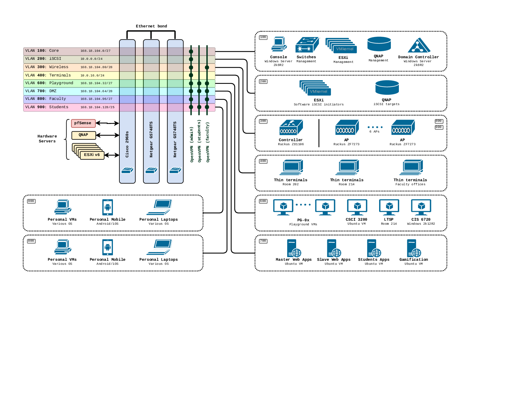

# Network

## General info

The network connectivity of the infrastructure is provided by means of direct connection to the PeachNET (network resource of the USG). Any experiments within network perimeter of the School's network appear to be isolated from the rest of the Campus network.

## IP addresses and routing
The PeachNET provides 2 IP address ranges: one for *direct* WAN access and one for *routed* LAN access.

### CIDR ranges
The following CIDR ranges are defined on the PeachNET for our infrastructure
-	WAN: `168.18.64.166/29`
-	LAN: `168.18.104.0/24`

### Incoming traffic
-	The incoming traffic to **WAN** is routed directly.
-	The incoming traffic to **LAN** is routed via `168.18.64.166`

### Outgoing traffic
All outgoing traffic goes through the default gateway `168.18.64.161`

## Network segments (VLANs)
The LAN scope is divided into a n umber of segments to support traffic isolation.

### VLAN 100. The Core
The **Core** VLAN is intended to host internal infrastructure traffic. It connects management interfaces of ESXi hosts, QNAP fileserver, switches, domain controller and some other entities. The CIDR range is currently defined as `168.18.104.0/27`

::: tip Recommendation
Move this VLAN into a dedicated *non-routable* NAT sub-network instead of hosting it on a routable IP range
:::
