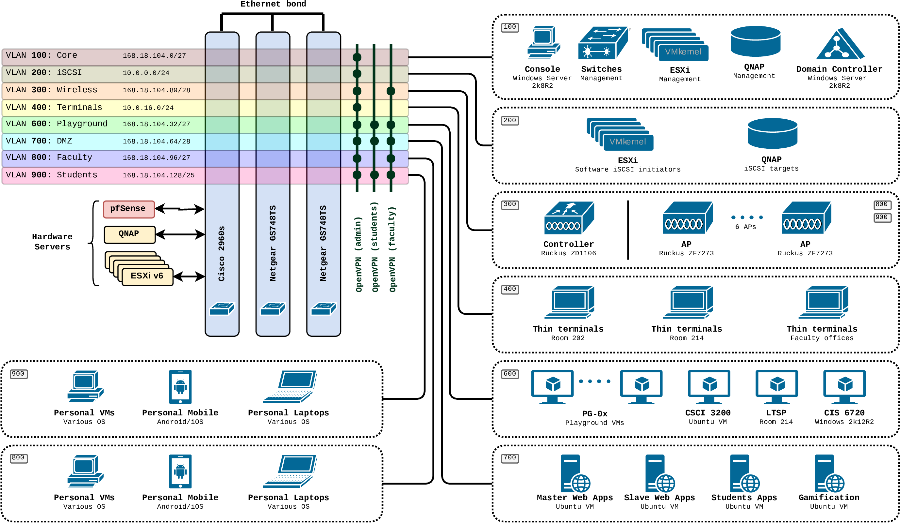

# Network segments (VLANs) for LAN
The LAN scope is divided into a number of segments to support traffic isolation.

The above diagram illustrates allocation of VLANs and their bindings to other entities of the infrastructure. 

## VLAN 100. The Core

The CIDR range is currently defined as `168.18.104.0/27`

The **Core** VLAN is intended to host internal infrastructure traffic. It connects management interfaces of ESXi hosts, QNAP fileserver, switches, domain controller and some other entities. 

::: tip Recommendation
Move this VLAN into a dedicated *non-routable* NAT sub-network instead of hosting it on a routable IP range
:::

## VLAN 300. Wireless management

The CIDR range is currently defined as `168.18.104.80/28`

This VLAN is intended to interconnect **wireless access points** (AP) and **wireless traffic controller**. There are 6 APs and 1 controller. They support delivery of other VLANs' traffic to end-user **wireless devices** (laptops, tablets, phones, etc) and can be configured to transparently reflect one or many VLANs to one or many WLANs. 

::: tip Recommendation
Move this VLAN into a dedicated *non-routable* NAT sub-network instead of hosting it on a routable IP range
:::

## VLAN 400. Terminals

The CIDR range is currently defined as `10.0.16.1/24` (NAT)

This VLAN allows for connectivity of thin/fat terminals in rooms 214 and 202. Those terminals have no permanent storage so they **network boot** at start time. This network also hosts a dedicated address allocated to one of the NICs of [LTSP server](/servers/#ltsp)

## VLAN 600. Playground

The CIDR range is currently defined as `168.18.104.32/27`

A number of VMs occupy this VLAN to provide resources for class projects. Examples include the following:
- Linux server for `CSCI 3200` UNIX course
- Management interface of the [LTSP server](/servers/#ltsp)
- A number of `PG-0x` Linux servers used for distributed software development in `CSCI 6220` course
- A `Windows 2016` server for `CIS 6720` course
- A number of VMs for `CSCI 4940` Capstone Project course

::: tip Recommendation
Having capacity of up to 30 routable IP address it is is recommended to **enforce a policy** of *DHCP* based IP address assignment (in favor of *static* allocation schema)
:::